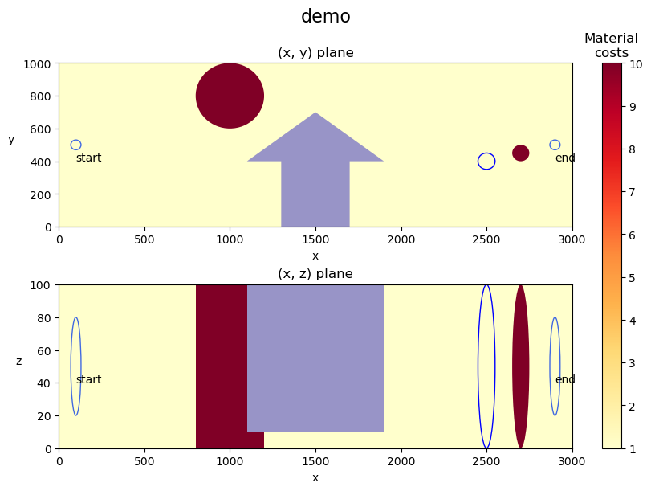

# tap-suite
This repository provides a suite of 12 benchmark problems for biobjective optimization, 
reflecting real-world-like problem of finding the optimal tunnel route. 
Problems in the suite have varying number of variables and are of different difficulty. 
In addition to the given suite of problems, it is possible to generate custom problem instances.
All benchmark runs are evaluated over 10000 function evaluations, 
typically completing in about 5 minutes on a standard machine.

### Instalation
`pip install tap-suite`


### 1. Optimizing the problems from the suite: 


```python
from tap import get_tap_suite
```
#### 1.A  Run suite problems with Pymoo


```python
# get the list of 12 problems from the suite, wrapped in a class that support optimization with pymoo library
suite = get_tap_suite(interface="pymoo") 
# pick one problem to optimize
problem = suite[3]
problem.name, problem.id
```


    ('TAP4', '15-areas_hor=1_ver=2_CV')


```python
from pymoo.algorithms.moo.nsga2 import NSGA2
from pymoo.optimize import minimize
from pymoo.termination import get_termination

# optimize selected problem with NSGA2 algorithm
algorithm = NSGA2(pop_size=100)
termination = get_termination("n_eval", 500)
results = minimize(problem, algorithm, termination, verbose=True)
```

    ==========================================================================================
    n_gen  |  n_eval  | n_nds  |     cv_min    |     cv_avg    |      eps      |   indicator  
    ==========================================================================================
         1 |      100 |      4 |  0.000000E+00 |  3.6479353710 |             - |             -
         2 |      200 |      7 |  0.000000E+00 |  0.0591441885 |  0.0242239185 |         ideal
         3 |      300 |      6 |  0.000000E+00 |  0.000000E+00 |  0.0183878428 |         ideal
         4 |      400 |      6 |  0.000000E+00 |  0.000000E+00 |  0.0724697403 |         ideal
         5 |      500 |      6 |  0.000000E+00 |  0.000000E+00 |  0.0973167994 |         ideal
    


```python
# problems from the suite already have approximations for ideal and nadir points set
problem.ideal, problem.nadir
```


    ([0, 0], [0.3018191170221708, 0.0003757249154668])


#### 1.B Run suite problems with jMetalPy


```python
from jmetal.algorithm.multiobjective.nsgaii import NSGAII
from jmetal.operator.crossover import SBXCrossover
from jmetal.operator.mutation import PolynomialMutation
from jmetal.util.termination_criterion import StoppingByEvaluations

# get the list of 12 problems from the suite, wrapped in a class that support optimization with jmetalpy library
suite = get_tap_suite(interface="jmetalpy")
problem = suite[3]

# optimize selected problem with NSGA2 algorithm
algorithm = NSGAII(
    problem=problem,
    population_size=100,
    offspring_population_size=100,
    mutation=PolynomialMutation(probability=1.0 / problem.number_of_variables(), distribution_index=20),
    crossover=SBXCrossover(probability=1.0, distribution_index=20),
    termination_criterion=StoppingByEvaluations(max_evaluations=500)
)
algorithm.run()
```

    [2025-05-22 11:07:32,827] [jmetal.core.algorithm] [DEBUG] Creating initial set of solutions...
    [2025-05-22 11:07:32,829] [jmetal.core.algorithm] [DEBUG] Evaluating solutions...
    [2025-05-22 11:07:36,332] [jmetal.core.algorithm] [DEBUG] Initializing progress...
    [2025-05-22 11:07:36,333] [jmetal.core.algorithm] [DEBUG] Running main loop until termination criteria is met
    [2025-05-22 11:07:48,901] [jmetal.core.algorithm] [DEBUG] Finished!
    

#### 1.C Run suite problems with other library/custom algorithm


```python
# create a custom interface that wraps the problems from the suite and defines the required methods (if needed)
class CustomProblem:
    def __init__(self, problem):
        self.problem = problem
        self.id = problem.id
        self.name = problem.name
        self.ideal = problem.ideal
        self.nadir = problem.nadir
        # ...

    def evaluate(self, x):
        constraints, objectives = self.problem.evaluate(x)
        return constraints, objectives
    
    # ...
```


```python
# get the suite of 12 problems and wrap them with the defined class
suite = get_tap_suite()
custom_suite = [CustomProblem(p) for p in suite]
```

### 2. Created problems
We created 6 different frames with various number of layouts, all together being 50 configurations. 
Together with six possible variants (genotype to phenotype matchings) this gives us 300 problems.

We designed 6 distinct frames, each representing a different tunnel alignment scenario. 
Every frame includes multiple layouts, totaling 50 unique configurations. 
Each configuration can be combined with 6 different genotype-to-phenotype mappings, 
resulting in 300 distinct biobjective optimization problems.

The table below summarizes the characteristics of each frame:

| frame          | Number of Layouts | Dimension Range |
|----------------|-------------------|-----------------|
| u-turn         | 6                 | 12-24           |
| next-to-tunnel | 10                | 12-36           |
| lr-ud          | 8                 | 18-36           |
| loop           | 6                 | 21-36           |
| left-right     | 10                | 12-28           |
| 15-areas       | 10                | 12-32           |

#### u-turn


#### next-to-tunnel


#### lr-ud


#### loop


#### left-right


#### 15-areas


### 3. Generating Problems
In this section we explain how to generate custom problem instances

```python
problem = {} # Problem is represented as a python dictionary
```

Set the problem id and geometric constraints


```python
problem["problem_id"] = "demo_problem"

problem["max_horizontal_turns"] = 2
problem["max_vertical_turns"] = 2
problem["basic_material_cost"] = 1
problem["max_gradient"] = 0.05
```

Set the area of the problem, determined with limits and obstacles


```python
limits = {    
    "x": [0, 3000],
    "y": [0, 1000],
    "z": [0, 100]
}

obstacles = [
    {
        "type": "circle",
        "center": [1000, 800],
        "r": 200,
        "price": 10
    },
    {
        "type": "sphere",
        "center": [2700, 450, 50],
        "r": 50,
        "price": 10
    },
    {
        "type": "polygon", 
        "points": [
            [1500, 700],
            [1900, 400],
            [1700, 400],
            [1700, 0],
            [1300, 0],
            [1300, 400],
            [1100, 400]
        ],
        "z": [10, 100]
        # no price defined -> infeasible obstacle
    }
]

problem["bounds"] = {
    "limits": limits,
    "obstacles": obstacles
}
```

Set the positions of start, end and given points


```python
start_point = {
    "x": 100,
    "y": 500,
    "z": 50,
    "r_max": 30,
    "h_angle": 0,
    "h_angle_tol": 45,
    "v_angle": 0,
    "v_angle_tol": 5
}
end_point = {
    "x": 2900,
    "y": 500,
    "z": 50,
    "r_max": 30,
    "h_angle": -180,
    "h_angle_tol": 45,
    "v_angle": -180,
    "v_angle_tol": 5
}
given_points = [{
    "x": 2500,
    "y": 400,
    "z": 50,
    "r_max": 50,
    "h_angle": 0,
    "h_angle_tol": 180,
    "v_angle": 0,
    "v_angle_tol": 5,
    "order": 0.5
}]

problem["points"] = {
    "start_point": start_point,
    "end_point": end_point,
    "given_points": given_points,
    "free_points_threshold": 0.25  
}
```

Set the objectives, constraints and evaluation tree (best to leave it as is)


```python
problem["objectives"] = ["costs", "effects"]

problem["constraints"] = ["horizontal_curvature", "vertical_curvature", "gradient",
                          "point_distance_deviation",
                          "point_horizontal_angle_deviation", "point_vertical_angle_deviation"]

problem["hard_constraints"] = ["out_of_bound_points", "hard_constraint_obstacles",
                               "horizontal_turns", "vertical_turns", "self_intersections"]

problem["evaluation_tree"] = {
    "weight": 1,
    "direction": "min",
    "norm_min": 0,
    "norm_max": 1,
    "inputs": {
        "costs": {
            "weight": 0.5,
            "direction": "min",
            "norm_min": 0,
            "norm_max": 100000
        },
        "effects": {
            "weight": 0.5,
            "direction": "min",
            "bound": 0,
            "norm_min": 0,
            "norm_max": 0.6,
            "inputs": {
                "horizontal_curvature": {
                    "weight": 0.1,
                    "direction": "min",
                    "norm_min": 0,
                    "norm_max": 1,
                    "bound": 0.1
                },
                "vertical_curvature": {
                    "weight": 0.1,
                    "direction": "min",
                    "norm_min": 0,
                    "norm_max": 1,
                    "bound": 0.1
                },
                "gradient": {
                    "weight": 0.1,
                    "direction": "min",
                    "norm_min": 0,
                    "norm_max": 1,
                    "bound": 0.05
                },
                "point_distance_deviation": {
                    "weight": 0.1,
                    "direction": "min",
                    "norm_min": 0,
                    "norm_max": 3000,
                    "bound": 0
                },
                "point_horizontal_angle_deviation": {
                    "weight": 0.1,
                    "direction": "min",
                    "norm_min": 0,
                    "norm_max": 3.141592653589793,
                    "bound": 0
                },
                "point_vertical_angle_deviation": {
                    "weight": 0.1,
                    "direction": "min",
                    "norm_min": 0,
                    "norm_max": 3.141592653589793,
                    "bound": 0
                }
            }
        }
    }
}

```

Finally, set the ideal and nadir points


```python
problem["ideal"] = [0, 0]
problem["nadir"] = [1, 1]
```

Visualize the created problem


```python
from tap import TunnelAlignmentProblem

tap_problem = TunnelAlignmentProblem(problem, "AFV")
fig = tap_problem.plot_problem()
```


    

    


Wrap the problem into the Pymoo interface class and run optimization


```python
from tap import PymooProblem
pymoo_problem = PymooProblem(tap_problem)

from pymoo.algorithms.moo.nsga2 import NSGA2
from pymoo.optimize import minimize
from pymoo.termination import get_termination

algorithm = NSGA2(pop_size=100)
termination = get_termination("n_eval", 500)
result = minimize(pymoo_problem, algorithm, termination, verbose=True, seed=42)
```

Plot the problem with the results


```python
non_dominated_results = result.X
fig2 = tap_problem.plot_problem(non_dominated_results)
```


    

    

